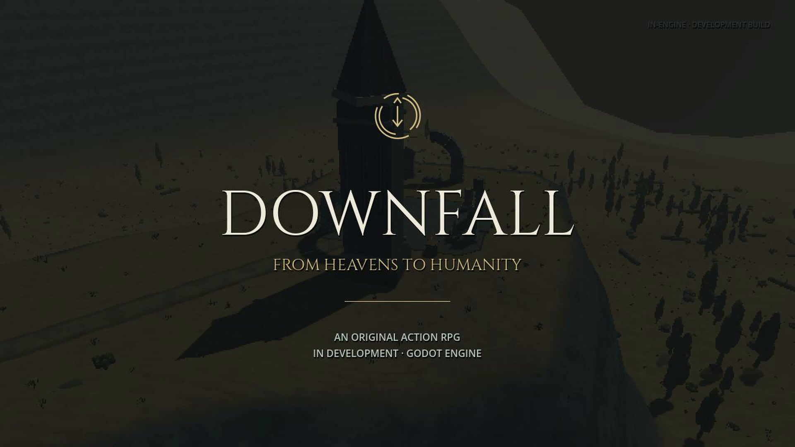

  

# DOWNFALL: From Heavens to Humanity

**Developed by Retro B.O.T.**

*Leave eternity behind. Become human.*

An original fantasy action RPG in development with **Godot Engine**, featuring a descending mountain world, pixel-styled 3D environments, and characters created in Blender.

## The trailer

**[Watch the trailer on the showcase page](https://gabmac222.github.io/downfall-from-heavens-to-humanity/#trailer)** · [Download the trailer](assets/trailer.mp4)

Follow Caelum down the mountain, discover the memories Heaven erased, and meet the champions standing between him and a human life.

[The original trailer is also available in Releases.](https://github.com/Gabmac222/downfall-from-heavens-to-humanity/releases/tag/trailer-v1)

## Latest world update — September 2026

**[Explore 57 current prototype views](https://gabmac222.github.io/downfall-from-heavens-to-humanity/updates/latest-world-update/)**

- **21 regional house designs** across seven styles, placed across **54 homes** with grounded terraces, clear entrances and supported lamps.
- **Seven hero sculptures and three winged guardian designs**, created in Blender with regional relics, draped clothing and layered feathers.
- Cloud banks around the highest stages, fading during the descent; fitted supports for shelters and civic structures.
- Improved moving-camera clearance around shrine columns and gate arches.

The refinement review recorded **6,431 passing checks across 20 suites**, including a five-minute native run with full motion coverage at ten locations. Four isolated frame-time spikes were recorded on the local Apple M5; these results describe that scripted review, not a performance guarantee. The gallery includes the review's scope and remaining prototype limitations.

## Why I’m building this game

For me, it starts with the endless shackles of work handed down from above. I wanted to be different. I wanted to show my own vision, and this game is how I’m doing that.

Defining what’s missing in our lives, and what it means to become human, is what I wanted to explore through DOWNFALL. I relate that feeling to Caelum’s journey from Heaven toward humanity.

I also follow the history of old heroes and bring their stories into the world I’m building. God bless them and their contributions. In DOWNFALL, I imagine heroes who are already shackled above, still bound to duty. Their stories are part of how I express that same feeling of wanting a different path.

I just relate everything here: the work, the old heroes, the shackles, and the wish to become human. This is what I wanted to show through this game. My own vision.

— **Retro B.O.T.**

## The story

Heaven promised its champions eternity. It took their memories instead.

You are **Caelum**, Heaven's former Grand Archivist, who chooses to surrender immortality and become human. The path toward Earth winds down through seven celestial regions: ruined shrines, steep mountain passes, forgotten refuges, and storm-worn heights.

Recover the human memories Heaven erased. Confront the champions bound to its order. Follow the traces of kindness that give a finite life its meaning.

## The gameplay

- Descend mountain switchbacks, cross deep gorges, and explore a connected world of changing elevations.
- Fight with sword and shield or a pilgrim spear, combining attacks, guards, deflections, and dodges.
- Spend celestial grace on magic and **Gracefall**, an ability that slows your descent through the air.
- Discover memories, rest at shrines, gather supplies, and face the champions Daran, Maelis, and Raigen.

## Development status

The trailer presents the current playable prototype. The complete campaign and remaining champion encounters are still in development. Release date unannounced.

This repository shares the project overview, logo, trailer, development updates, and public showcase pages. It does not distribute a playable build.

**Developed by Retro B.O.T. · Built with Godot Engine · Character assets created in Blender**
